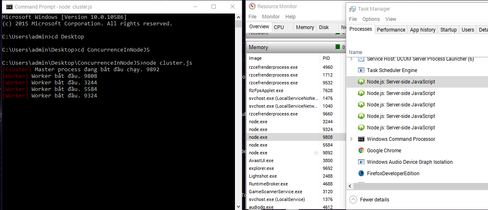

# Hello World: Phân phối chức năng trong NodeJS sử dụng Cluster Module.

* Concurrency in NodeJS using the Cluster Module  
*  Viết bởi Ben Nadel vào mùng 7 tháng 5 năm 2017  
*  Tags: Javascript / DHTML  
*  Dịch bởi Phan Quân  
*  Nguồn https://www.bennadel.com/blog/3234-hello-world-concurrency-in-node-js-using-the-cluster-module.htm  

## Bài Dịch

Gần đây,tôi cảm thấy rất bối rối với một số vấn đề về kiến trúc phần mềm,nên tôi đành đọc lại bài viết  Clean Code: A Handbook Of Agile Software Craftsmanship by [Uncle Bob] Robert C. Martin. Một trong những themes (chủ đề) mà liên tục được nhắc tới trong bài viết là những vấn đề bị thay đổi bởi nhiều lý do khác nhau nên phải phân chia riêng rẽ chúng.Ví dụ,trong chương Concurrency (Phân phối chức năng),Chú Bob có viết:

> Các Trạng thái chính yếu duy nhất (Single Responsibility Principle) vốn đưa ra các Method/Class/Component nên chỉ có một Tác nhân thay đổi (reason to change).  
> Kiến trúc Phân phối chức năng (Concurrency Design) đủ phức tạp để trở thành một Tác nhân thay đổi và vì thế,nên được phân chia riêng rẽ so với phần còn lại của code. Đáng tiếc rằng các tiểu tiết về việc thực thi Phân phối chức năng thường bị ép (code) thẳng vào các phần code nội dung. Tại đây, ta có một số vấn đề cần cân nhắc:  
> * Các đoạn code liên quan tới phân phối có vòng đời riêng về phát triển,thay đổi và điều chỉnh (Development,chaging and tuning).  
> * Các đoạn code liên quan tới phân phối rất thử thách, và thường khác và khó hơn rất nhiều các đoạn code khác.   
> * Do có rất nhiều lỗi khi viết các đoạn code phân phối làm cho việc viết code đủ khó khi chưa hề làm phức tạp các đoạn code ứng dụng xung quanh.  

Việc trên đã làm tôi nghĩ tới Cluster Module của NodeJS. Thực ra tôi chưa từng sử dụng Cluster module bao giờ; do tôi chủ yêu giúp duy trì các đoạn code NodeJS có sẵn chứ không hẳn là viết ra chúng. Nhưng một hôm Kris Siegel nêu vấn đề trên lên Twitter. Và tỏ ra khá bối rối với các vấn đề khác, thế nên tôi nghĩ tôi sẽ giúp anh ấy bối rối một cách hài hước khi tạo một ứng dụng Hello Word  dử dụng Cluster.

Khi bạn chạy một quá trình của NodeJS, nó sẽ chạy trên một luồng (thread) duy nhất. Việc này có nghĩa là nó chỉ kết nối với một nhân (core) duy nhất trên máy chủ. Để có thể sử dụng một cách hiệu quả nhất sức mạnh các máy đa nhân (multi-core),ta sẽ phải chạy nhiều quá trình của NodeJS cùng một lúc. Các quá trình này có thể thực hiện ở ngoài NodeJS nhưng NodeJS cung cấp một cách thức để thực hiện chúng luôn bên trong, đó chính là Cluster Module.

Khi bạn sử dụng Cluster module, điểm khởi tạo của ứng dụng sẽ được thực thi nhiều lần: Một lần Quá trình Chính (Master Process) và mỗi lần một lần cho các Quá trình Phụ (Worker Process) vốn được chia nhánh (fork) từ Master (Cluster chạy ngầm phương thức child_process.fork()). Khi các Worker tự chạy một cách riêng biệt trên nền tảng V8 process, ta sẽ thấy sự quyến rũ của Cluster module ở tỏng việc mỗi Worker sẽ chia sẻ port của chúng với Master. Vì thế mỗi Worker có thể 'nghe' (listen) trên cùng một port giống như Master của chúng, làm cho việc phân phối request tới các Worker một cách giống nhau,công bằng.  

Bây giờ, quay lại vấn đề về phân phối chức năng mà Chú Bob đã đề cập tới ở trên, tôi sẽ không định nghĩa cả Concurrency logic và Server logic ở cùng một file mà tôi sẽ chia chúng ra làm hai:
	- cluster.js: file này sẽ xử lý vấn đề về Phân phối chức năng (Concurrence) và chia nhánh (fork) giữa Master/Worker.
	- server.js: file này sẽ xử lý logic về Server đơn luồng (Single-thread).


```javascript

// Gọi tới các core node module
var chalk = require( "chalk" );
var cluster = require( "cluster" );
var os = require( "os" );

// ----------------------------------------------------------------------------------- //
// ----------------------------------------------------------------------------------- //


// cluster module trong nodejs hoạt động bằng cách xử lý entry-point của ứng dụng
// nhân lên và chia sẻ các Master Port với các Worker port. Như vậy, đoạn code này 
// cần phải phân biệt giữa Master process và (các) Worker process đã được phân chia (fork).
if ( cluster.isMaster ) {

    console.log( chalk.red( "[Cluster]" ), "Master process đang bắt đầu chạy.", process.pid );

    // Vì mỗi NodeJS process xử lý trên một luồng (thread) riêng, nên ta sẽ tạo
    // Các Worker process dựa trên số lượng của Nhân (Cores) có sẵn trên hệ thống.
    // Bằng cách này, các Workers không cần phải choảng nhau để sử dụng tài nguyên 
    // của hệ thống
    for ( var i = 0, coreCount = os.cpus().length ; i < coreCount ; i++ ) {

        var worker = cluster.fork();

    }

    
    // Khi 'vòng đời' của Workers kết thúc,cluster sẽ tạo ra một 'exit' event
    // cho phép ta dùng chúng để thêm mới các Worker process
    cluster.on(
        "exit",
        function handleExit( worker, code, signal ) {

            console.log( chalk.yellow( "[Cluster]" ), "Worker kết thúc.", worker.process.pid );
            console.log( chalk.yellow( "[Cluster]" ), "Tử ẹo:", worker.exitedAfterDisconnect );

            // Nếu một Worker bị buộc kết thúc một cách vô ý như không bắt (catch) được ngoại lệ (exception).
            // Thì khi đó ta sẽ thử (try) tại tạo lại (restart) nó.

            if ( ! worker.exitedAfterDisconnect ) {

                var worker = cluster.fork();

                // CHÝ Ý: Nếu Worker kết thúc ngay lập tức, có lẽ do code bị bug,
                // bạn có thể dính lỗi [theo tôi BIẾT] tiêu thụ tài nguyên CPU liên tục
                // (rapid CPU Consumption) do Master liên tiếp thử tạo mới các Worker.

            }

        }
    );

} else {

    // Lúc nào ta xử lý phân phối chức năng cũng cần phải phân chia riêng rẽ phần code 
    // phân phối ra khỏi các đoạn code khác. Làm vậy sẽ giúp ta tránh định nghĩa Worker 
    // trong nó. Thay vào đó, ta sẽ gọi (require) tới từ một module khác. Cuối cùng việc 
    // này sẽ cho phép ta chạy ứng dụng theo Cluster mode hay một cách Độc lập bằng cách
    // sử dụng các entry-point khác nhau (cluster.js vs server.js)
    require( "./server" );

    console.log( chalk.red( "[Worker]" ), "Worker bắt đầu.", process.pid );

}


```

Đoạn code trên thực ra thực thi nhiều hơn một chút so với trên NodeJS documentation, một phần vì nó đã phân chia riêng rẽ server logic ra khỏi cluster logic. Nhưng như bạn đã thấy, ta đang chia nhánh (fork) càng nhiều Worker so với số lượng nhân trên hệ thống máy chủ. Việc này theo lý thuyết sẽ Phân phối các request tới ứng dụng và sẽ được xử lý bới các tài nguyên trong các quá trình khác nhau.

Với setup trên, Server module của chúng ta - logic của ứng dụng - không cần phải quan tâm tới việc ta làm với Cluster. Bên trong Server, ta sẽ cài đặt một HTTP server một cách thông thường. Và theo đó,module này sẽ chia sẻ port với Master.


```javascript
// Gọi tới các core node module
var http = require( "http" );

// ----------------------------------------------------------------------------------- //
// ----------------------------------------------------------------------------------- //

// Tại đây, các Worker sẽ chạy trên V8 process độc lập - và không chia sẻ bộ nhớ với
// Cluster hay các Worker khác. Một ngoại lệ đáng chú ý là nó được phép chia sẻ port với
// Cluster. Do đó,mỗi Worker sẽ chia sẻ  port 8000 với Cluster. Hay nếu module phải chạy 
// dưới dạng entry-point của ứng dụng thì nó sẽ dùng luôn port 8000 như mọi lần nó 
// chạy mà không cần Cluster
http
    .createServer(
        function handleRequest( request, response ) {

            response.writeHead(
                200,
                {
                    "Content-Type": "text/html"
                }
            );
            response.write( "Hello world from process " + process.pid + "." );

            // Để Cluster phân bổ các requests thông qua thuật toán điều phối Round Robin
            // thông thường -TRONG DEMO- tôi sẽ giữ các requests luôn mở để có thể  
            // sinh ra các concurrent requests tới Cluster
            setTimeout( response.end.bind( response ), 300 );

        }
    )
    .listen( 8000 )
;
```

Như bạn thấy, chẳng có gì trong module này liên quan tới Cluster về mặt chức năng (chỉ trừ hàm setTimeOut() được sử dụng trong demo). Việc này không chỉ phân chia riêng rẽ vấn đề, nó còn giúp ta có thể chạy ứng dụng với Cluster:  

> node ./cluster.js   

hoặc không cần cluster, chạy như một process độc lập:  

> node ./server.js  

Việc trên giúp ta debug dễ dàng hơn rất nhiều trong khi debug vào trong các process dễ gây khó hiểu hơn rất nhiều.

Nói dông nói dài, nếu ta chạy ứng dụng, sử dụng cluster.js như một entry-point, ta có thể thấy các quá trình (process) Master và Worker hiện ra trên terminal. Và,nếu ta tác động tới một process,ta sẽ thấy nó được chia nhánh lại (re-fork)

<image-terminal>

Tôi đã biết về Cluster module trong một thời gian dài. Nhưng dạo trước nó không hẳn là một module 'ổn định', thế nên tôi không dành thời gian nghịch nó. Còn bây giờ nó đã 'ổn định' thì lại khá hay. Tất nhiên là sử dụng Cluster khi code sẽ cần nhiều logic hơn những gì tôi viết trên và nhìn chung mà nói, Cluster cho bạn những lợi ích to lớn mà không phải quan tâm xử lý nhiều.  

## Test

* Setup các Modules cần thiết:  

> npm install node_modules --save  
> npm install chalk --save  
> npm install cluster --save  
> npm i os --save  

* Sử dụng Terminal để chạy Cluster:

> node cluster.js


	> Tại cửa sổ Command,ta sẽ thấy cluster tạo ra 1 master và 4 worker tương ứng với 4 cores của máy chủ.  
	> Tại của sổ Resources Monitor,ta sẽ thấy 5files Node.exe có số PID tương ứng với master và workers ở trên.  
	> Tại Task Manager,ta cũng thấy 5 files node tương ứng.  
	
 
